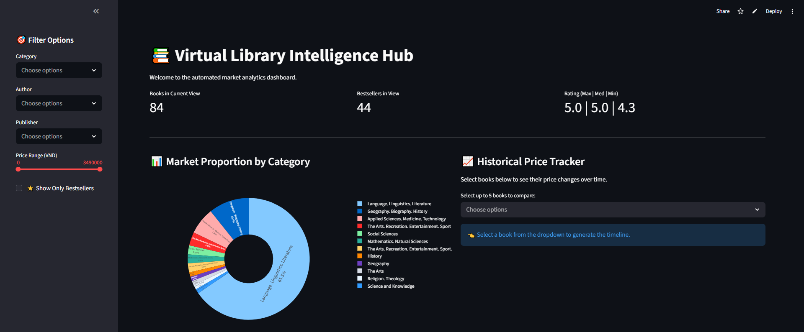
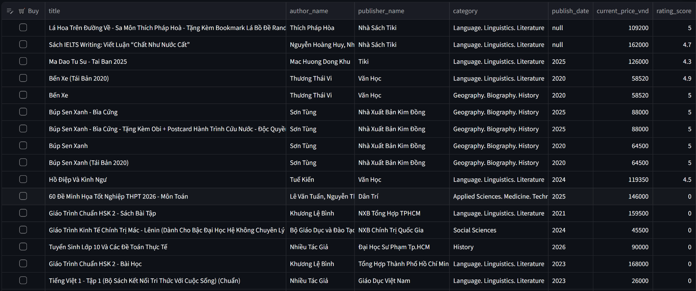
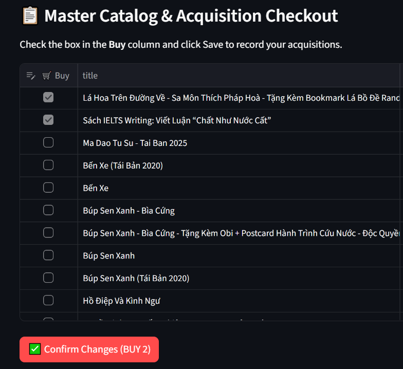
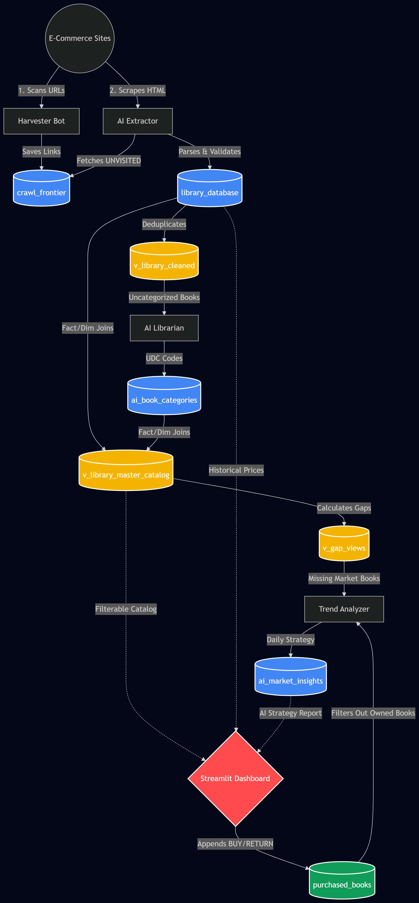

# Smart Virtual Library / Automated Price Scraper for Library's Book Procurement

> 👆 **Click the image above to view the live interactive dashboard!**

An intelligent, fully automated ETL pipeline and analytics dashboard designed to monitor e-commerce book markets, extract structured data, categorize literature, and generate strategic acquisition recommendations using Large Language Models (LLMs) and Google BigQuery.

---

## I. Purpose
The primary purpose of the **Smart Virtual Library** is to provide an automated, data-driven intelligence hub for library acquisitions and market analytics. By continuously monitoring major book retailers, the system identifies market trends, tracks historical price fluctuations, and detects gaps in the current library collection. It replaces manual cataloging and market research with a suite of specialized AI agents that autonomously discover, parse, classify, and analyze book data to deliver actionable strategic insights.

## II. Scope
The project encompasses an end-to-end data lifecycle, from raw web discovery to an interactive end-user dashboard:
* **Target Platforms:** Automated scraping of major book retailers, specifically configured for **Tiki** and **Fahasa** (for now due to token limits, but can be applied to other book sites like Amazon, etc. as well).
* **Data Acquisition:** Harvesting product URLs and bypassing modern anti-bot systems (e.g., Cloudflare) to extract raw HTML and Markdown data.
* **Data Processing:** Utilizing LLMs to reliably parse unstructured web data into strict, validated JSON schemas containing core book metadata (Title, Author, Publisher, Dates, Prices) and demand proxies (Ratings, Review Counts, Bestseller badges).
* **Classification:** Automatically assigning Universal Decimal Classification (UDC) codes to books based on their titles and overviews.
* **Strategic Analysis:** Analyzing missing inventory ("gaps") at both the macro (category) and micro (individual book) levels to generate AI-driven acquisition recommendations.
* **Visualization:** Providing a web-based dashboard for stakeholders to filter the master catalog, visualize category proportions, and track historical pricing timelines.

## III. Technical Features

### 1. Automated ETL Pipeline (GitHub Actions)
* Fully orchestrated via `.github/workflows/daily_scraper.yml`.
* Uses timed cron jobs to sequentially run the Harvester, Extractor, Categorizer, and Trend Analyzer scripts daily.
* Manages sensitive credentials (GCP keys, Groq API keys) via GitHub Secrets.

### 2. Stealth Harvester (Spider)
* **Built with Playwright:** Uses asynchronous, headless Chromium browsers with user-agent rotation.
* **Bot-Evasion:** Implements `playwright-stealth` and automated scrolling to trigger lazy-loaded elements and bypass basic security checks.
* **State Management:** Saves newly discovered, unvisited URLs directly into a BigQuery `crawl_frontier` table.

### 3. Dual-Agent AI Extractor
* **HTML to Markdown:** Converts raw, messy DOM content into compressed Markdown using `markdownify` to optimize LLM token usage.
* **Universal Core Agent:** Uses Groq (`llama-4-scout`) to logically deduce and extract core book attributes regardless of the source language or page structure.
* **Metrics Sidecar Agent:** A specialized secondary LLM prompt designed strictly to extract volatile demand proxies (ratings, review counts) and normalize international number formats (e.g., converting 'tr'/'k' to pure integers).
* **Pydantic Validation:** Ensures all LLM outputs strictly conform to the expected data types before database insertion.

### 4. AI Librarian (Categorizer)
* Uses a dedicated Groq prompt (`llama-3.1-8b-instant`) to act as an expert Head Librarian.
* Analyzes book overviews and assigns the single most accurate Top-Level Universal Decimal Classification (UDC) code (e.g., "8 - Literature", "5 - Natural Sciences").

### 5. Hybrid Trend Analyzer
* Queries BigQuery for macro-level category gaps and micro-level book priorities (based on bestseller status and review counts).
* Uses a heavy-weight reasoning model (`llama-3.3-70b-versatile`) to synthesize this data into specific "Micro-Trends".
* Generates a structured JSON response containing the top 3 high-priority acquisition targets and the strategic reasoning behind the recommendations.

### 6. Interactive Intelligence Dashboard
* **Built with Streamlit:** A responsive web application (`app.py`) serving as the primary user interface.
* **Live BigQuery Connection:** Caches and loads the master catalog directly from the Google Cloud data warehouse.
* **Dynamic Filtering:** Allows granular searches by Category, Author, Publisher, Price Range, and Bestseller status.
* **Plotly Visualizations:** Features interactive pie charts for market proportions and line graphs for tracking historical book prices across multiple scrape dates.

### 7. Closed-Loop Acquisition Ledger (Event Sourcing)
The dashboard is not just a read-only reporting tool; it is a fully interactive, two-way application. Users can directly modify the library's inventory from the UI, with changes instantly syncing back to the cloud database.
* **Interactive Inventory Management:** Users can check or uncheck a "Buy" box directly inside the Streamlit data table to mark books as acquired or returned.
* **Free-Tier Optimized Writes:** To bypass BigQuery's strict DML (Data Manipulation Language) pricing blocks, the application uses an Append-Only Ledger (Event Sourcing). Instead of deleting or updating rows, the system securely appends timestamped BUY or RETURN actions, creating a fully auditable financial paper trail at zero cost.
* **Auto-Syncing AI:** The moment a book is checked out in the UI, the BigQuery views update instantly. The 70B AI Strategist reads this ledger and autonomously drops acquired books from its future Daily Recommendation Reports.

## IV. Database Architecture & Replication

To replicate this project, you must create the necessary tables in Google BigQuery. 
We have provided a [schema.sql](schema.sql) file containing the exact Data Definition Language (DDL) queries. Simply copy and paste the contents into your BigQuery SQL Workspace to initialize the environment.

### ETL Data Flow

